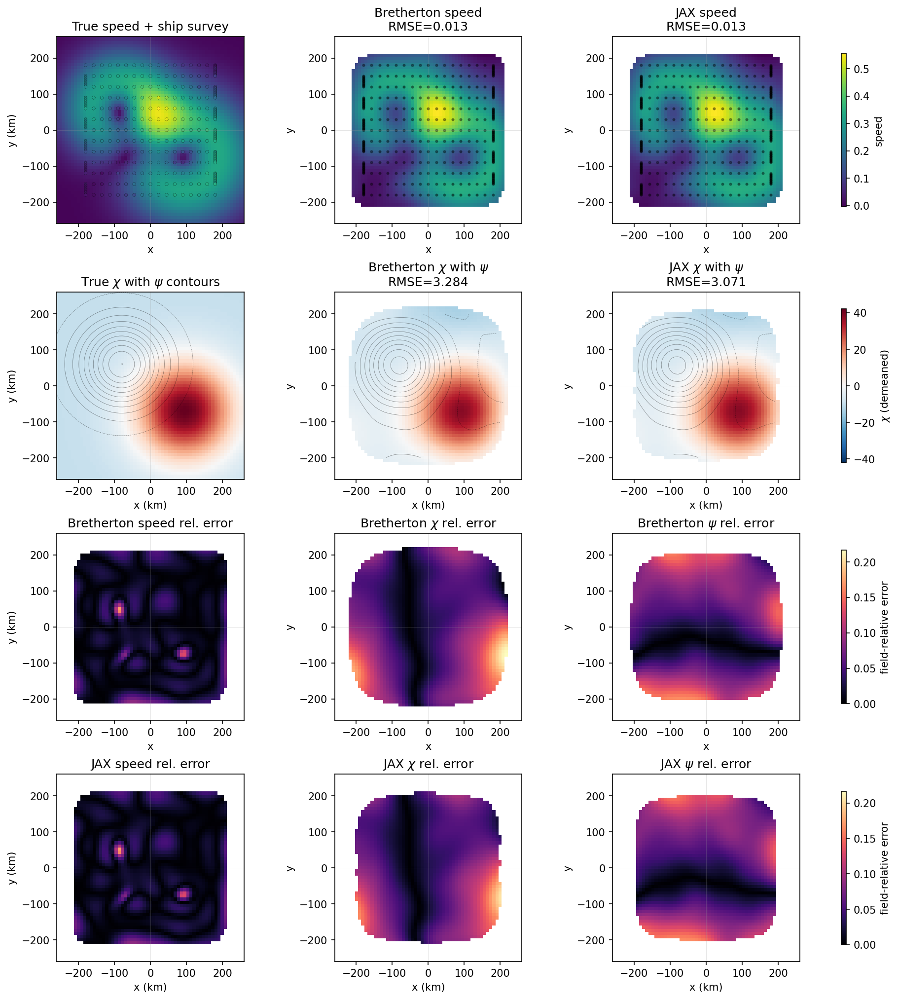

# xobjmap

Xarray-native objective mapping and interpolation of scattered observations.


## Installation

With pip:
```bash
pip install xobjmap              # numpy only
pip install 'xobjmap[jax]'      # + JAX (CPU)
pip install 'xobjmap[jax-cuda]' # + JAX with GPU (CUDA 12)
```

With pixi (recommended for development):
```bash
pixi add xobjmap
```

## Quick start

```python
import numpy as np
import xarray as xr
import xobjmap

# Scattered observations
obs = xr.Dataset(
    {"temp": ("station", temp_data)},
    coords={"lon": ("station", lons), "lat": ("station", lats)},
)

# Target grid
target = xr.Dataset(
    coords={"lon": np.linspace(-40, -38, 50), "lat": np.linspace(-24, -22, 40)}
)

# Scalar objective analysis
result = obs.xobjmap.scalar(
    "temp", target, corrlen={"lon": 1.0, "lat": 0.5}, err=0.1
)
result.temp   # interpolated field
result.error  # normalized error map

# Streamfunction recovery
obs_vel = xr.Dataset(
    {"u": ("station", u_data), "v": ("station", v_data)},
    coords={"lon": ("station", lons), "lat": ("station", lats)},
)
result_psi = obs_vel.xobjmap.streamfunction(
    "u", "v", target, corrlen={"lon": 1.0, "lat": 0.5}, err=0.1
)
result_psi.psi
result_psi.psi_error

# Velocity potential recovery
result_chi = obs_vel.xobjmap.velocity_potential(
    "u", "v", target, corrlen={"lon": 1.0, "lat": 0.5}, err=0.1
)
result_chi.chi
result_chi.chi_error

# Helmholtz decomposition
result = obs_vel.xobjmap.helmholtz(
    "u", "v", target,
    corrlen_psi={"lon": 1.0, "lat": 0.5},
    corrlen_chi={"lon": 1.0, "lat": 0.5},
    err=0.1,
)
result.psi
result.chi
result.psi_error
result.chi_error
```

## Example: ADCP Transects Through a Simple Helmholtz Flow

The example script `examples/adcp_convergent_vortices.py` builds synthetic
ship ADCP transects across a simple theoretical flow made from:

- a Gaussian streamfunction `psi` that generates a non-divergent vortex
- a Gaussian velocity potential `chi` that generates a non-rotational
  convergent feature
- current speed used for scalar objective mapping

It compares the classic Bretherton direct solve (`backend="numpy"`) and the
JAX backend for both scalar mapping and Helmholtz recovery.

Run it with:

```bash
pixi run -e docs python examples/adcp_convergent_vortices.py
```



The ship survey is confined to a narrower `[-180, 180]` footprint in both `x`
and `y`, which makes the edge uncertainty more visible. The first row compares
the true speed field sampled along the ship survey against scalar
reconstructions using a shared row colorbar. The second row shows the true
velocity potential `chi` with streamfunction `psi` contours, followed by the
Helmholtz reconstructions with a shared row colorbar. The third row shows the
Bretherton field-relative errors for speed, `chi`, and `psi`, and the fourth
row shows the corresponding JAX field-relative errors. These are normalized by
each true field's peak magnitude so the panels remain comparable despite their
different units. The reconstructed panels mask mapped values where the
normalized posterior error exceeds a fixed threshold, using a stricter cutoff
for speed than for the Helmholtz potential fields so that `psi` and `chi`
remain visible.

## Benchmarking

For large 3-D Helmholtz backend comparisons, use:

```bash
pixi run -e test-jax-cuda python examples/benchmark_helmholtz_3d.py
```

This benchmark targets the accessor N-D Helmholtz path with
`interp_dims=('x', 'y', 'z')` and `derivative_dims=('x', 'y')`, and defaults
to comparing dense NumPy against JAX on CUDA.

Examples:

```bash
pixi run -e test-jax-cuda python examples/benchmark_helmholtz_3d.py \
  --sizes 900 1400 2000 --nx 80 --ny 80 --nz 3

pixi run -e test-jax-cuda python examples/benchmark_helmholtz_3d.py \
  --sizes 1000 3000 10000 --nx 100 --ny 100 --nz 5

pixi run -e test-jax-cuda python examples/benchmark_helmholtz_3d.py \
  --backends jax-gpu --sizes 2000 3000 4000 6000
```

The dense NumPy memory estimate printed by the benchmark is a lower bound for
the dominant arrays, not a full process-memory prediction. Real NumPy RSS can
be substantially larger because of temporaries, solve workspace, and allocator
overhead.

Results can also be written to JSON or CSV:

```bash
pixi run -e test-jax-cuda python examples/benchmark_helmholtz_3d.py \
  --sizes 900 1400 2000 --json /tmp/helmholtz3d.json --csv /tmp/helmholtz3d.csv
```

## API Reference

### Accessor methods

#### `ds.xobjmap.scalar(var, target, corrlen, err, backend="numpy", return_error=True, k_local=None)`

Interpolates a scalar variable from scattered observations onto target locations.

| Parameter | Type | Description |
|-----------|------|-------------|
| `var` | `str` | Variable name in the dataset |
| `target` | `xr.Dataset` | Target coordinates |
| `corrlen` | `dict` or `float` | Correlation length scales (same units as coordinates) |
| `err` | `float` | Normalized error variance (0 to 1) |
| `return_error` | `bool` | If `True`, also compute and return the error field |
| `k_local` | `int` or `None` | Local neighborhood size for JAX error estimates |

Returns an `xr.Dataset` with the interpolated field and an `error` variable.

#### `ds.xobjmap.scalar_error(target, corrlen, err, backend="numpy", k_local=None)`

Returns only the scalar interpolation error field for the target grid.

#### `ds.xobjmap.streamfunction(u_var, v_var, target, corrlen, err, b=0, backend="numpy", return_error=True, k_local=None)`

Recovers the streamfunction from scattered velocity observations, assuming purely nondivergent flow.

| Parameter | Type | Description |
|-----------|------|-------------|
| `u_var` | `str` | Eastward velocity variable name |
| `v_var` | `str` | Northward velocity variable name |
| `target` | `xr.Dataset` | Target grid coordinates |
| `corrlen` | `dict` or `float` | Correlation length scales (same units as coordinates) |
| `err` | `float` | Normalized error variance (0 to 1) |
| `b` | `float` | Mean correction parameter (default: 0) |
| `return_error` | `bool` | If `True`, also compute and return `psi_error` |
| `k_local` | `int` or `None` | Local neighborhood size for JAX error estimates |

Returns an `xr.Dataset` with `psi` and, by default, `psi_error`.

#### `ds.xobjmap.streamfunction_error(u_var, v_var, target, corrlen, err, b=0, backend="numpy", k_local=None)`

Returns only the streamfunction posterior error field.

#### `ds.xobjmap.velocity_potential(u_var, v_var, target, corrlen, err, b=0, backend="numpy", return_error=True, k_local=None)`

Recovers the velocity potential from scattered velocity observations, assuming purely irrotational flow.

| Parameter | Type | Description |
|-----------|------|-------------|
| `u_var` | `str` | Eastward velocity variable name |
| `v_var` | `str` | Northward velocity variable name |
| `target` | `xr.Dataset` | Target grid coordinates |
| `corrlen` | `dict` or `float` | Correlation length scales (same units as coordinates) |
| `err` | `float` | Normalized error variance (0 to 1) |
| `b` | `float` | Mean correction parameter (default: 0) |
| `return_error` | `bool` | If `True`, also compute and return `chi_error` |
| `k_local` | `int` or `None` | Local neighborhood size for JAX error estimates |

Returns an `xr.Dataset` with `chi` and, by default, `chi_error`.

#### `ds.xobjmap.velocity_potential_error(u_var, v_var, target, corrlen, err, b=0, backend="numpy", k_local=None)`

Returns only the velocity-potential posterior error field.

#### `ds.xobjmap.helmholtz(u_var, v_var, target, corrlen_psi, corrlen_chi, err, b=0, backend="numpy", return_error=True, k_local=None)`

Helmholtz decomposition: jointly recovers the streamfunction and velocity potential from scattered velocity observations.

| Parameter | Type | Description |
|-----------|------|-------------|
| `u_var` | `str` | Eastward velocity variable name |
| `v_var` | `str` | Northward velocity variable name |
| `target` | `xr.Dataset` | Target grid coordinates |
| `corrlen_psi` | `dict` or `float` | Correlation length scales for the streamfunction |
| `corrlen_chi` | `dict` or `float` | Correlation length scales for the velocity potential |
| `err` | `float` | Normalized error variance (0 to 1) |
| `b` | `float` | Mean correction parameter (default: 0) |
| `return_error` | `bool` | If `True`, also compute and return `psi_error` and `chi_error` |
| `k_local` | `int` or `None` | Local neighborhood size for JAX error estimates |

Returns an `xr.Dataset` with `psi`, `chi`, and, by default, `psi_error` and `chi_error`.

#### `ds.xobjmap.helmholtz_error(u_var, v_var, target, corrlen_psi, corrlen_chi, err, b=0, backend="numpy", k_local=None)`

Returns only the Helmholtz posterior error fields `psi_error` and `chi_error`.

### Low-level functions

All low-level functions accept `backend="jax"` for lower memory usage and optional GPU acceleration.

#### `xobjmap.scalar(xc, yc, x, y, t, corrlenx, corrleny, err, backend="numpy")`

Scalar Gauss-Markov estimation. Returns the interpolated field `tp`.

#### `xobjmap.scalar_error(xc, yc, x, y, corrlenx, corrleny, err, backend="numpy", k_local=None)`

Scalar interpolation error field. Returns normalized mean squared error `ep`. Depends only on observation geometry, not on the observed scalar values. The JAX backend uses a local neighborhood approximation (`k_local` nearest observations per target point).

#### `xobjmap.streamfunction_error(xc, yc, x, y, corrlenx, corrleny, err, b=0, backend="numpy", k_local=None)`

Posterior error field for streamfunction recovery. Depends only on geometry, not on observed velocities.

#### `xobjmap.streamfunction(xc, yc, x, y, u, v, corrlenx, corrleny, err, b=0, backend="numpy")`

Recovers the streamfunction on the target grid `(xc, yc)`, assuming nondivergent flow.

#### `xobjmap.velocity_potential_error(xc, yc, x, y, corrlenx, corrleny, err, b=0, backend="numpy", k_local=None)`

Posterior error field for velocity-potential recovery. Depends only on geometry, not on observed velocities.

#### `xobjmap.velocity_potential(xc, yc, x, y, u, v, corrlenx, corrleny, err, b=0, backend="numpy")`

Recovers the velocity potential on the target grid `(xc, yc)`, assuming irrotational flow.

#### `xobjmap.helmholtz_error(xc, yc, x, y, corrlenx_psi, corrleny_psi, corrlenx_chi, corrleny_chi, err, b=0, backend="numpy", k_local=None)`

Posterior error fields for Helmholtz recovery. Returns `(psi_error, chi_error)`. Depends only on geometry, not on observed velocities.

#### `xobjmap.helmholtz(xc, yc, x, y, u, v, corrlenx_psi, corrleny_psi, corrlenx_chi, corrleny_chi, err, b=0, backend="numpy")`

Helmholtz decomposition. Returns `(psi, chi)` on the target grid.

## Notes

- Correlation lengths must be in the **same units** as the coordinates. If working with lon/lat in degrees, either express corrlen in degrees or convert to a projected coordinate system first.
- The streamfunction convention follows Bretherton et al. (1976): `u = -dpsi/dy`, `v = dpsi/dx`.
- The velocity potential convention: `u = dchi/dx`, `v = dchi/dy`.
- Error fields are normalized posterior uncertainties, not absolute physical-unit errors.
- Scalar error and potential-field error are different inverse problems and should not be compared as if they were the same quantity.
- The NumPy backend uses the direct dense Bretherton solve.
- The JAX backend computes fields with a matrix-free conjugate-gradient solve and avoids global dense observation-covariance assembly.
- JAX error fields use local-neighborhood solves (`k_local`) rather than global dense posterior solves, so JAX errors should be close to, but not expected to exactly match, the NumPy direct solution.

## References

Bretherton, F. P., Davis, R. E., & Fandry, C. B. (1976). A technique for
objective analysis and design of oceanographic experiments applied to MODE-73.
*Deep-Sea Research*, 23(7), 559-582.
