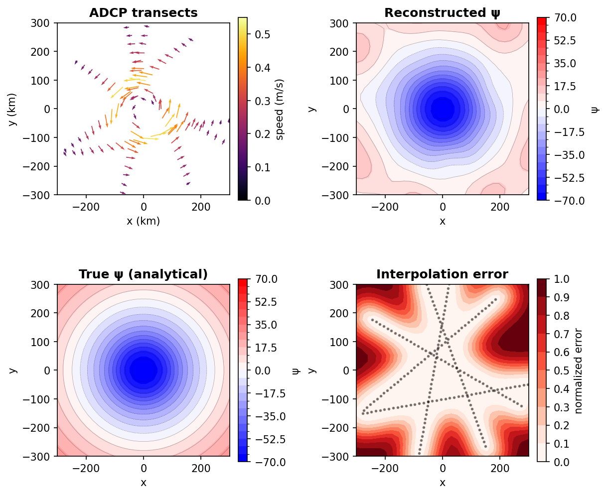

# xobjmap

Xarray-native objective mapping and interpolation of scattered observations.



## Installation

With pixi (recommended):
```bash
pixi add xobjmap
```

With conda:
```bash
conda install -c conda-forge xobjmap
```

## Quick start

```python
import numpy as np
import xarray as xr
import xobjmap

# Scattered observations
obs = xr.Dataset(
    {"temp": ("station", temp_data)},
    coords={"lon": ("station", lons), "lat": ("station", lats)},
)

# Target grid
target = xr.Dataset(
    coords={"lon": np.linspace(-40, -38, 50), "lat": np.linspace(-24, -22, 40)}
)

# Scalar objective analysis
result = obs.xobjmap.scalar_interp(
    "temp", target, corrlen={"lon": 1.0, "lat": 0.5}, err=0.1
)
result.temp   # interpolated field
result.error  # normalized error map

# Vectorial objective analysis
obs_vel = xr.Dataset(
    {"u": ("station", u_data), "v": ("station", v_data)},
    coords={"lon": ("station", lons), "lat": ("station", lats)},
)
psi = obs_vel.xobjmap.vector_interp(
    "u", "v", target, corrlen={"lon": 1.0, "lat": 0.5}, err=0.1
)
```

## API Reference

### Accessor methods

#### `ds.xobjmap.scalar_interp(var, target, corrlen, err)`

Interpolates a scalar variable from scattered observations onto target locations.

| Parameter | Type | Description |
|-----------|------|-------------|
| `var` | `str` | Variable name in the dataset |
| `target` | `xr.Dataset` | Target coordinates |
| `corrlen` | `dict` or `float` | Correlation length scales (same units as coordinates) |
| `err` | `float` | Normalized error variance (0 to 1) |

Returns an `xr.Dataset` with the interpolated field and an `error` variable.

#### `ds.xobjmap.vector_interp(u_var, v_var, target, corrlen, err, b=0)`

Recovers the streamfunction from scattered velocity observations.

| Parameter | Type | Description |
|-----------|------|-------------|
| `u_var` | `str` | Eastward velocity variable name |
| `v_var` | `str` | Northward velocity variable name |
| `target` | `xr.Dataset` | Target grid coordinates |
| `corrlen` | `dict` or `float` | Correlation length scales (same units as coordinates) |
| `err` | `float` | Normalized error variance (0 to 1) |
| `b` | `float` | Mean correction parameter (default: 0) |

Returns an `xr.Dataset` with a `psi` (streamfunction) variable.

### Low-level functions

#### `xobjmap.scaloa(xc, yc, x, y, t, corrlenx, corrleny, err)`

Scalar Gauss-Markov estimation. Returns `(tp, ep)` if `t` is provided, or just `ep` (error map) if `t` is `None`.

#### `xobjmap.vectoa(xc, yc, x, y, u, v, corrlenx, corrleny, err, b=0)`

Vectorial objective analysis. Returns the streamfunction on the target grid `(xc, yc)`.

## Notes

- Correlation lengths must be in the **same units** as the coordinates. If working with lon/lat in degrees, either express corrlen in degrees or convert to a projected coordinate system first.
- The streamfunction convention follows Bretherton et al. (1976): `u = -dpsi/dy`, `v = dpsi/dx`.

## References

Bretherton, F. P., Davis, R. E., & Fandry, C. B. (1976). A technique for
objective analysis and design of oceanographic experiments applied to MODE-73.
*Deep-Sea Research*, 23(7), 559-582.
